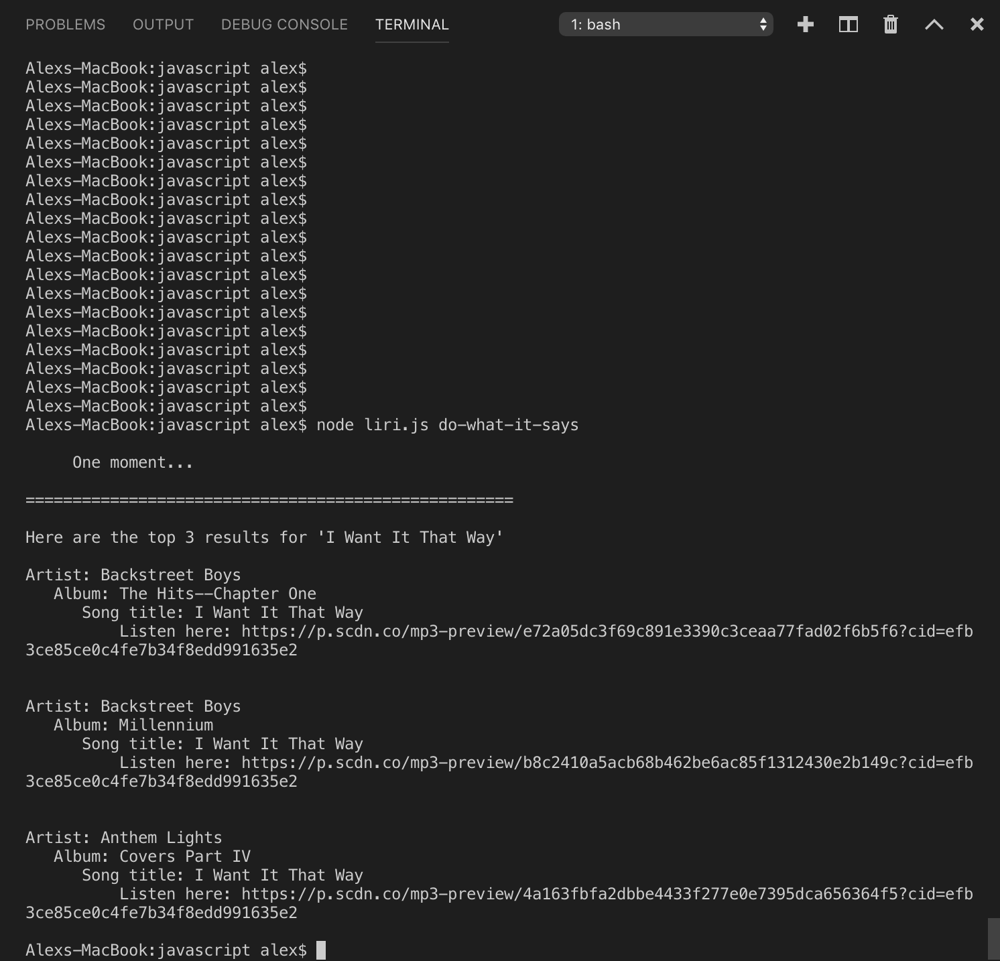

# LIRI-bot

Language Interpretation and Recognition Interface

## What is LIRI?

This project is an app that uses command line interface and node.js to imitate an iPhone's Siri function. The app takes in 4 different commands, as well as search terms. 

## Why is LIRI useful?

The current version allow a user to search for a movie, and LIRI will display information about the movie, pulled from the Open Movie Database API. Also, a user can search for a song title and be displayed the top results, as well as a short preview of the song. A user can also search for a musical artist or band and find the next date and venue of their upcoming concert.

## How to Use LIRI

After cloning the repository, type in your terminal `npm install` to grab all relevant dependencies.

In the terminal, navigate into the `javascript` directory, inside the `assets` directory.

Then, you can type any of these commands (replacing "<...>" with your search term(s))

#### The commands are as follows: 
* `node liri.js *movie-this* <movie-name-here>`
* `node liri.js *spotify-this-song* <song-title-here>`
* `node liri.js *concert-this* <artist-or-band-here>`
* `node liri.js *do-what-it-says*`

Note about `do-what-it-says` command: The `random.txt` file contains a string that will be used for the `do-what-it-says` command, so that command in particular does not need a search term. You can edit the `random.txt` file's string to change what is being searched when the command is called. It can potentially call the other 3 commands, but currently it will call the `spotify-this-song` command.

## How to Contribute to LIRI

I will continue to research licenses and contribution approaches in regard to this project.

## Maintenance and Contributors

This app is maintained by its sole contributor acbihm. This is my version of a homework assignment. 

## LIRI's Future and Issues

* The app would benefit from the ability to display concerts that are close to the user, rather than just all upcoming concerts with the `concert-this` command. 

* When using `do-what-it-says`

____________________________________________________

# Proof of LIRI Working
"spotify-this-song" command

"spotify-this-song" result

"concert-this" command

"concert-this" result

"movie-this" command

"movie-this" result

"do-what-it-says" command

"do-what-it-says" result
